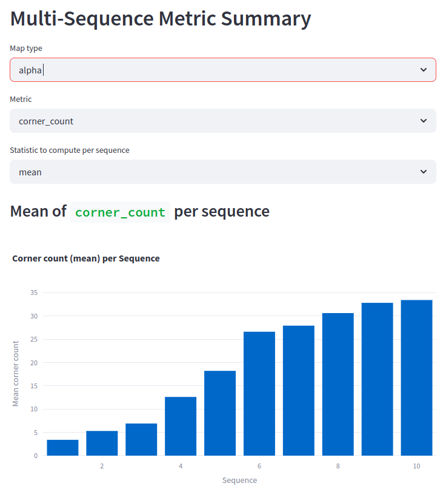
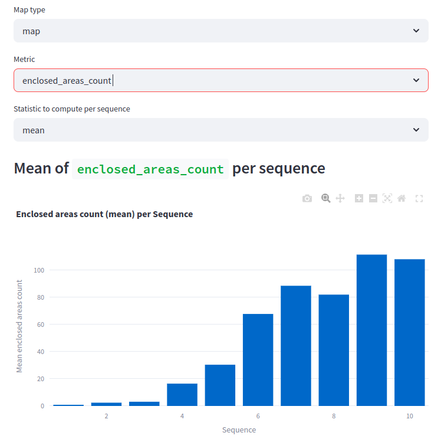
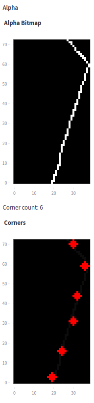
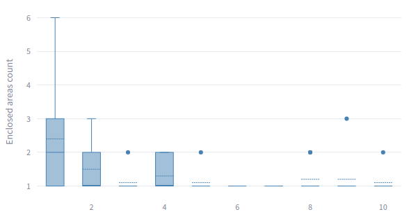

# Experiment: num_accumulated_range_data_selection

COMMIT: 0f50959415a8257f311cb5b6e7cf76d9e7389774

## Overview

How `num_accumulated_range_data` affects the individual scan quality. Can we select it using metrics?

## Results

Corner count explodes when value $>3$

Enclosed areas count remains stable when value $<3$

Seems that seting value to 3 is a good decision

## Additional notes
Corner count detection does not at `4/submap_4.pkl`
File is attached to the experiment: [submap_4.pkl](./submap_4.pkl)

Real corner count is 1, while algorithm detects 6

Corner count debug is needed. 

## Additional comment 

(from commit: 3123831f90b4394b3157b78c3d5d6b14558d9bb0)

Boxplot shows that values 6 and 7 are pretty stable

So, more robust experiment with increased number of samples and larger scope 

