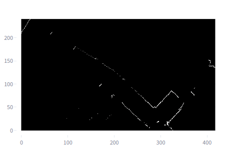
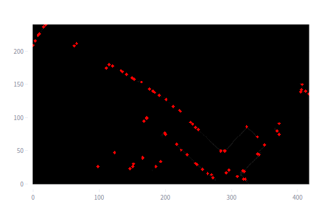
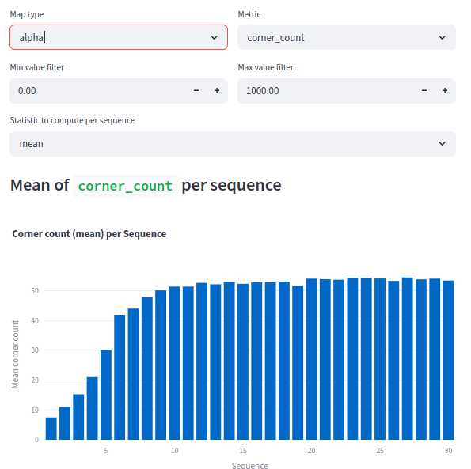
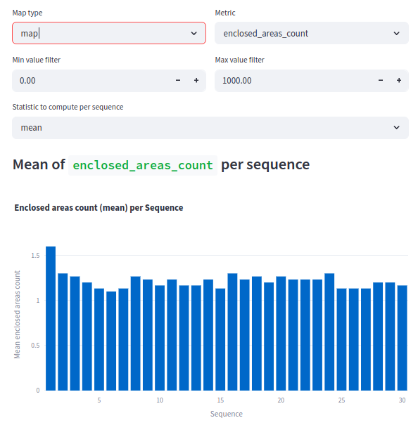
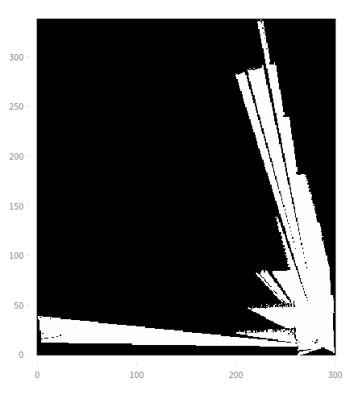
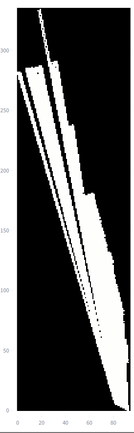
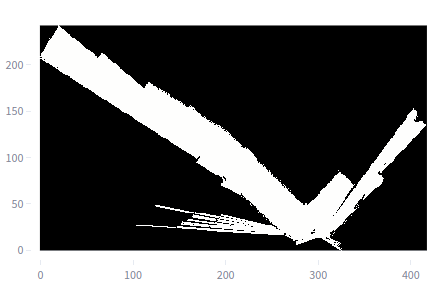
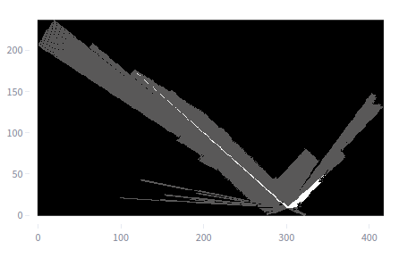

# Experiment: num_accumulated_range_data_selection_3

COMMIT: cd80519298f2b943ca4210d16bc1139d7a9d7acc

## Overview

The idea is to rerun `2025-04-16_21-17-35_num_accumulated_range_data_selection` with updated metrics and with use of broader range of values. 

Hypothesis: it is possible to provably select `num_accumulated_range_data`

## Results

Large number of individual dots makes corner count metric irrelevant. 

Example:

Thus, increased number of corners could be ignored. 

----

More relevant metric is `enclosed_areas_count` which shows strong descending trend from 1 to 6. However, it is hard to interpret results with `num_accumulated_range_data > 6`.

Moreover, human evaluation shows that scan with `num_range_data = 6` seems less detailed than `num_range_data = 30`

Below we provide two pairs of intensity maps (with increased contrast):

#### Example 1:
`/data/maps/num_acc_range_data_3/30/submap_3.pkl`:

`/data/maps/num_acc_range_data_3/6/submap_3.pkl`:

#### Example 2:

`/data/maps/num_acc_range_data_3/30/submap_0.pkl`:

`/data/maps/num_acc_range_data_3/6/submap_0.pkl`:

Thus, there is a need for one more experiment with larger values of `num_accumulated_range_data`
