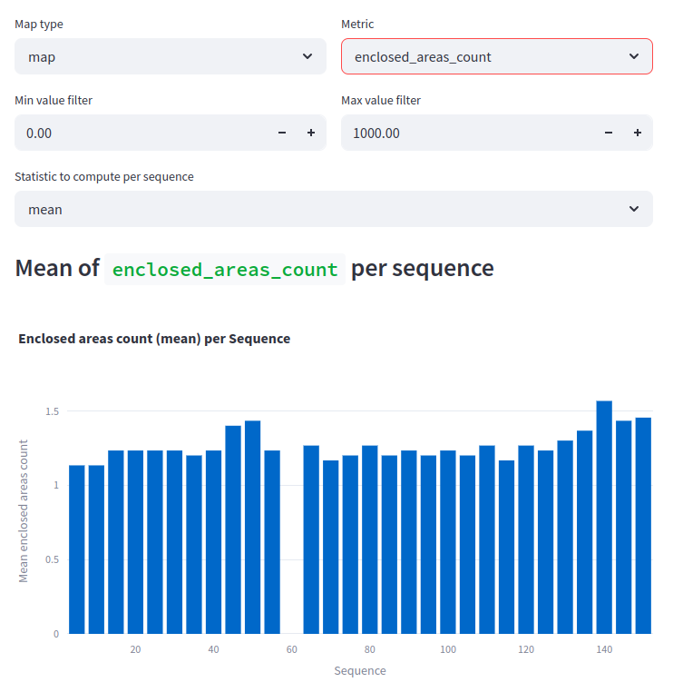

# Experiment: num_accumulated_range_data_selection_4

COMMIT: 9334ec6fc6c3cd0ebcc0f12575b1de538be1bd3c

## Overview

rerun `2025-04-17_20-44-56_num_accumulated_range_data_selection_3` with larger range of values and increased number of samples. 

Hypothesis: at some point maps will become worse and metrics at `num_accumulated_range_data = 100` will be significantly worse than at `num_accumulated_range_data = 5`.

## Results

corner count slightly grow, this it is proved that large values are not for `num_accumulated_range_data`. Best value `num_accumulated_range_data = 6` from the previous experiment should be taken. 

