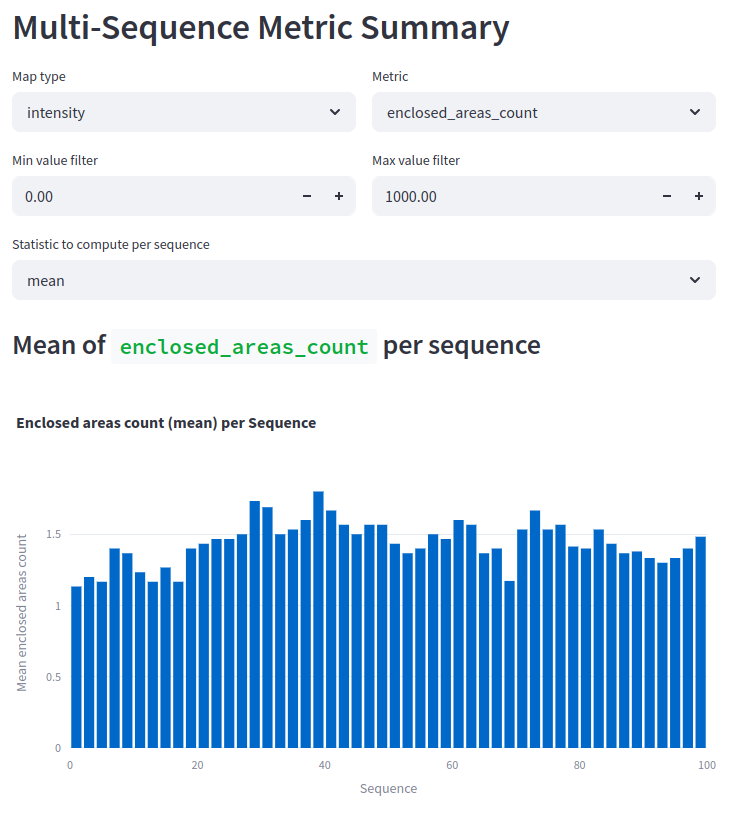

# Experiment: num_range_data_selection

COMMIT: c65b9130ce175db58db161bb1d9ef8a7890ae7a2

## Overview

The goal is to enumerate large number of possible `num_range_data` and understand if some insights can be gathered from the metrics. 

## Results

Seems that the data is too noisy to make conclusions

