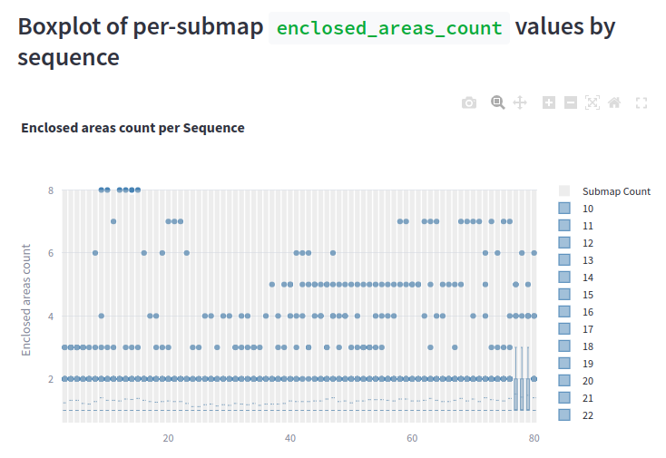
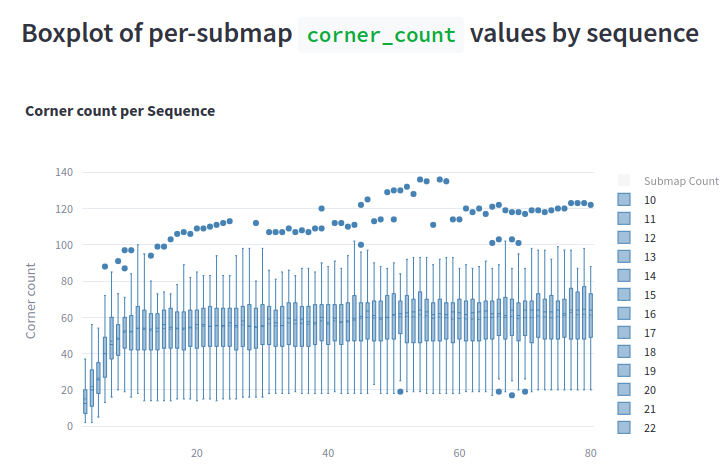
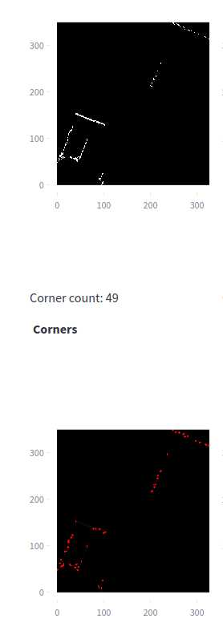

# Experiment: num_accumulated_range_data_selection_5

COMMIT: 61c04511d5d23fe221b589307e0999659b1b079b

## Overview

Rerun `2025-04-16_21-17-35_num_accumulated_range_data_selection` experiment with larger range and more samples to get more representative data.

## Results

Boxplots show good range of values withput outliers in range `[26-36]`

Meanwhile, `corner_count` does not seem representative because values are too large. 

It happens mostly because small discrete dots are intepreted as corners.

Example with `/data/maps/num_acc_range_data_5/80/submap_3.pkl`:

Seems that we have to revert corner detector.