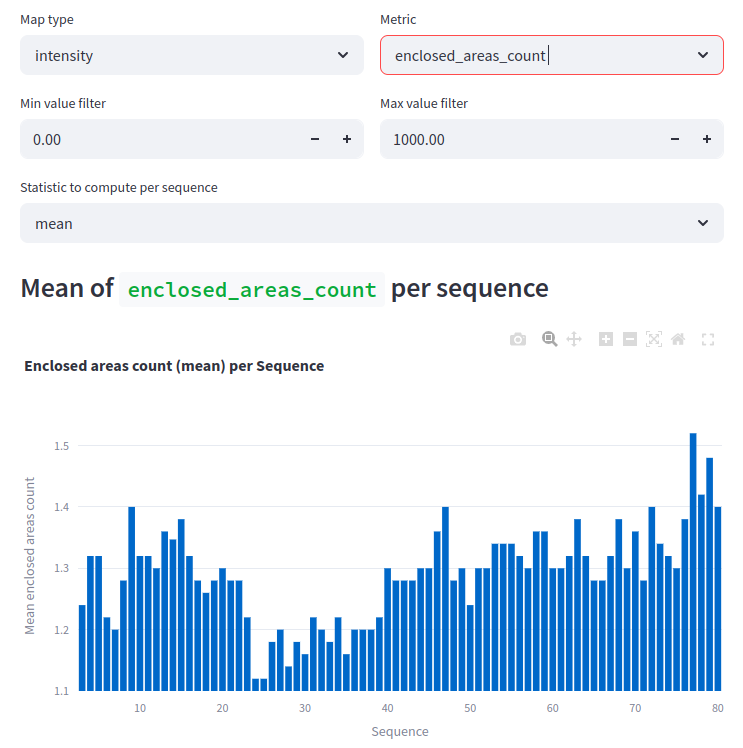
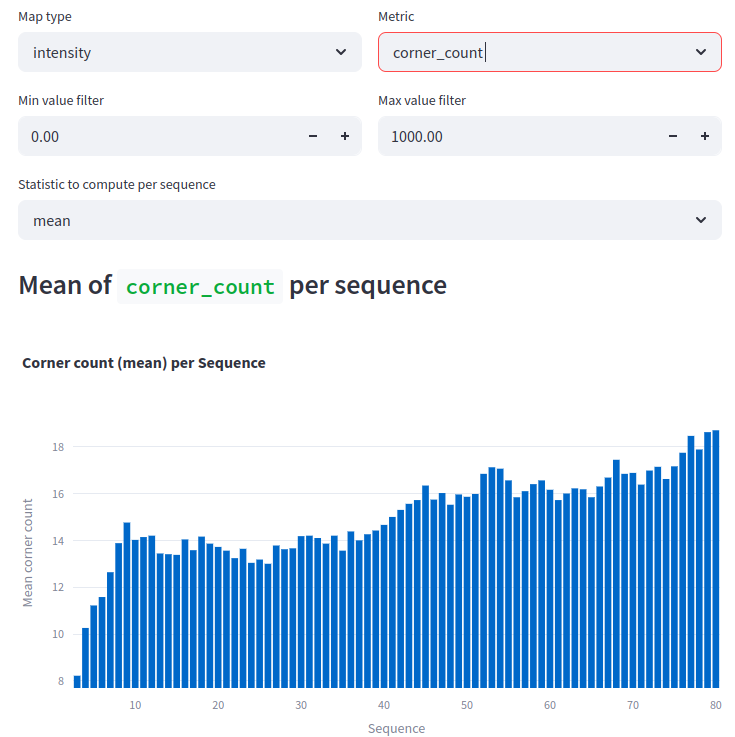
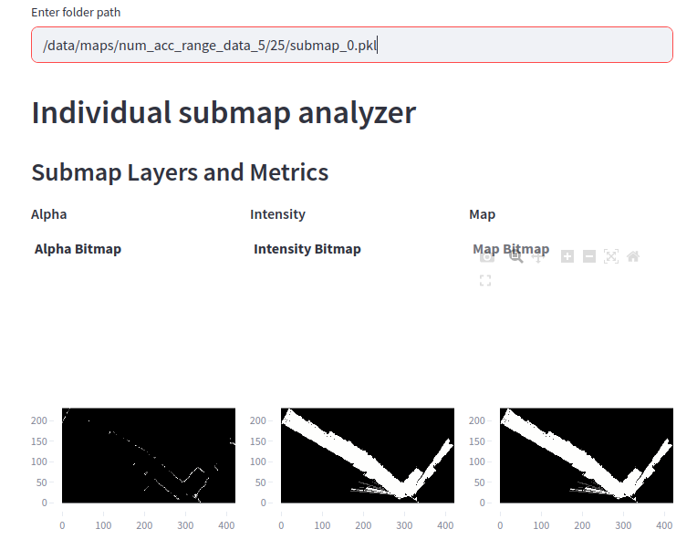
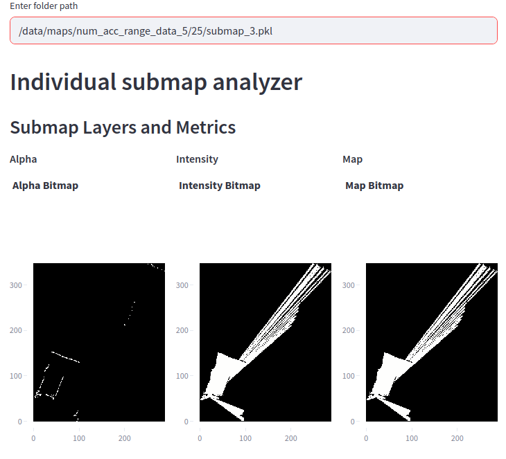
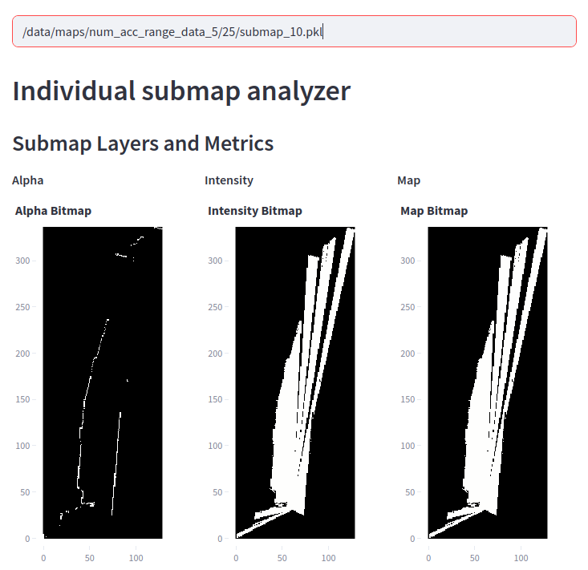
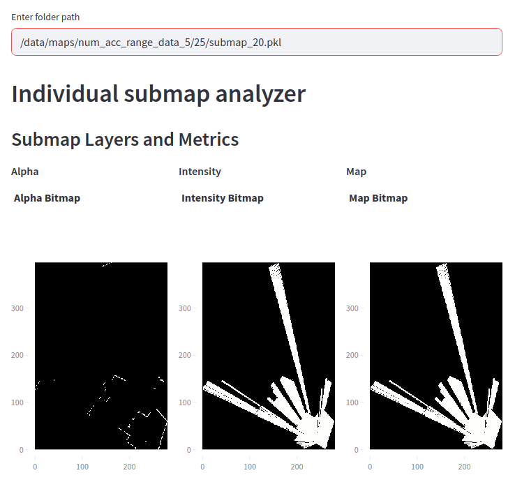
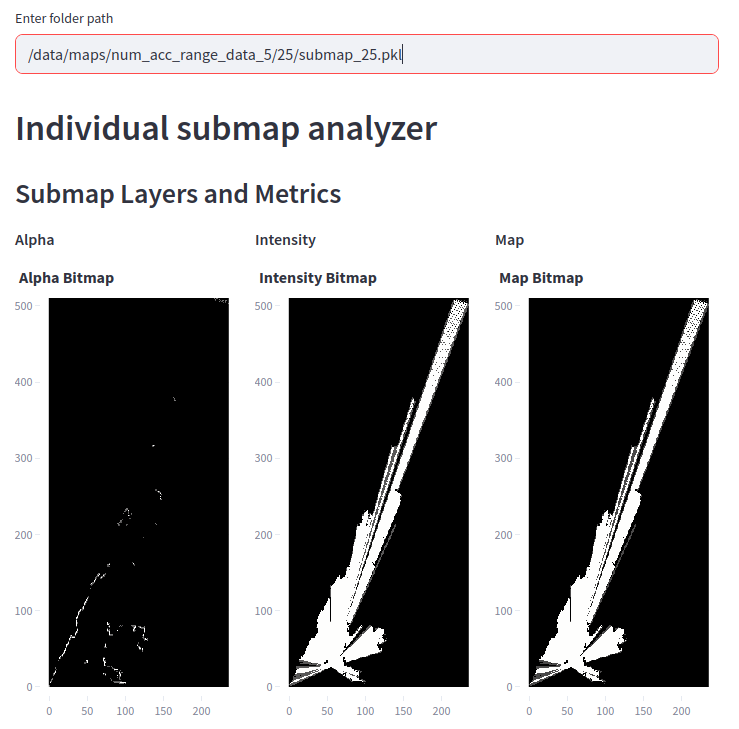

# Experiment: num_accumulated_range_data_selection_5

COMMIT: 61c04511d5d23fe221b589307e0999659b1b079b

## Overview

Rerun `2025-04-16_21-17-35_num_accumulated_range_data_selection` experiment with larger range and more samples to get more representative data.

## Results

Boxplots show good range of values withput outliers in range `[26-36]`

Meanwhile, `corner_count` does not seem representative because values are too large. 

It happens mostly because small discrete dots are intepreted as corners.

Example with `/data/maps/num_acc_range_data_5/80/submap_3.pkl`:

Seems that we have to revert corner detector.

## Additional note
(from commit `e8e3eb5aea2e621758161c1f8fe92a6fdfde911f`)

With improved visualization, it is more clear that value from `[26-36]` is the best choice

`corner_count` over `intensity` has an area of local minimum at `13-35` giving additional hint that this value is a good seleciton.

Since `24-26` has smallest `corner_count` locally and `24-25` are global minimum of `enclosed_areas_count` it makes sence to select value `25`

Scans at `25` seem good:

