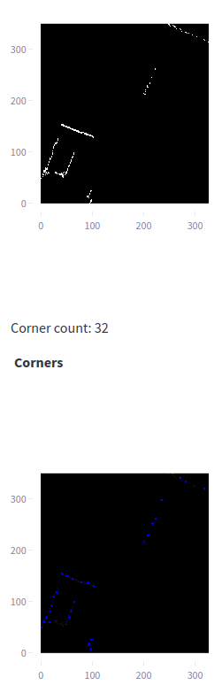
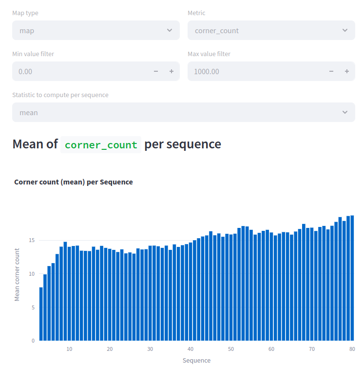

# Experiment: corner_count_check

COMMIT: eabc337722630b891d73cbe570e844e5efc5c6f6

## Overview

Goal: check if default corner count detector from commit `e649d3bc` works bettern than modified one at `bf5b9b77f26d`.

Updated calculator detects many extra corners.

Expected that old one detects ~14-20 cornerns.

## Results

Experiment failed, too many extra corners detected. 

Decided to drop discrete dots.

Moreover, it is noted that `corner count` is more reasonable if measured on layers other than `alpha`

## Note

submap `pkl` is saved [here](./submap_3.pkl) 