# Experiment: num_range_data_selection_2

COMMIT: 328958d0e7af636e66f114c71e631b135e4aac58

## Overview

Goal: rerun `2025-04-17_21-45-42_num_range_data_selection` but with properly selected `num_accumulated_range_data` (see experiment `2025-04-19_14-10-01_num_accumulated_range_data_selection_5`) to find best `num_range_data`. 

## Results

Experiment interrupted. The problem is that scans are not properly matched. Below there is an example for one map:

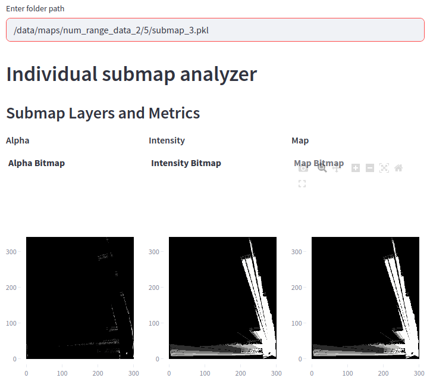
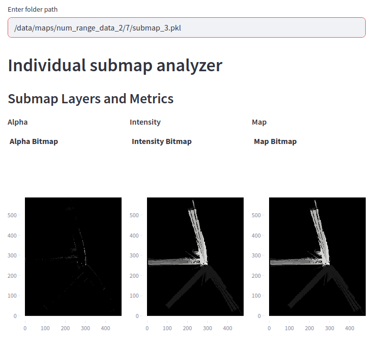
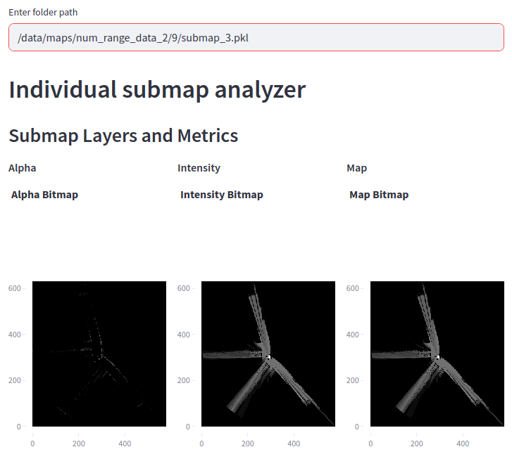
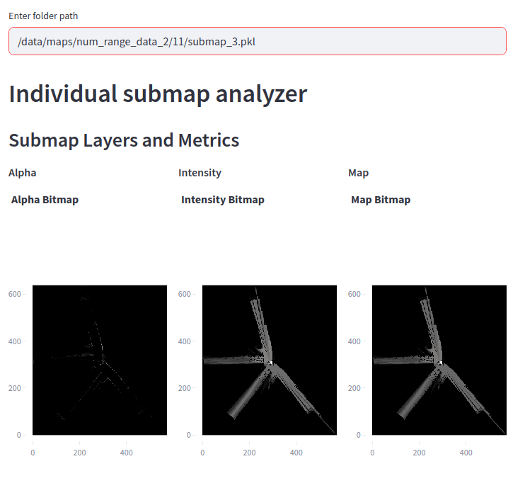
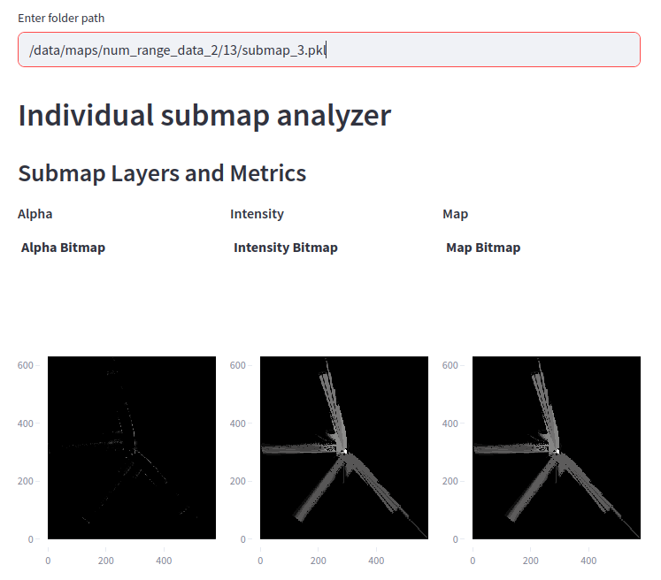
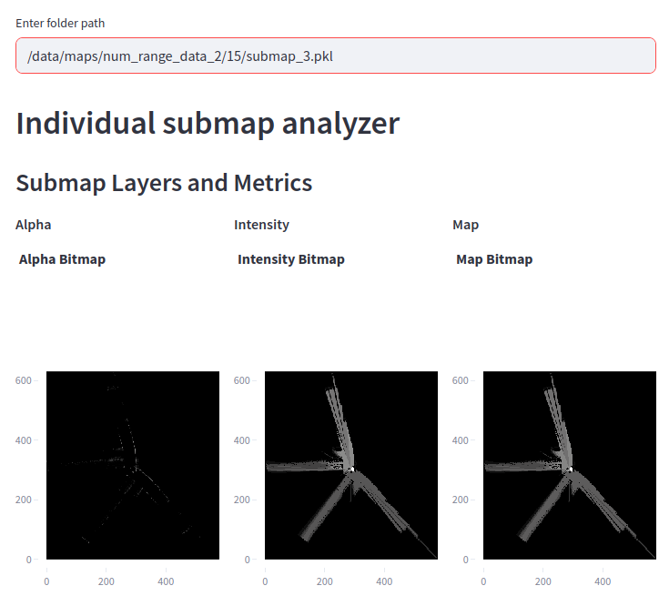
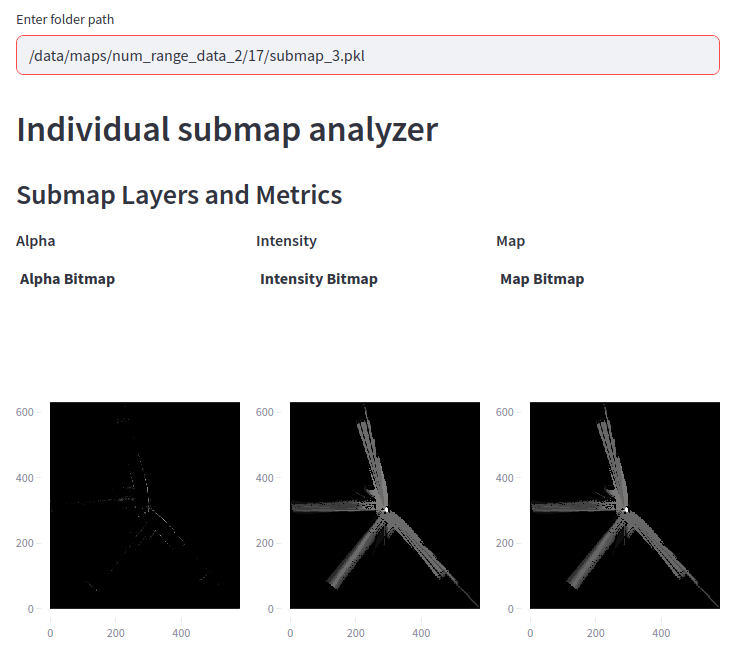
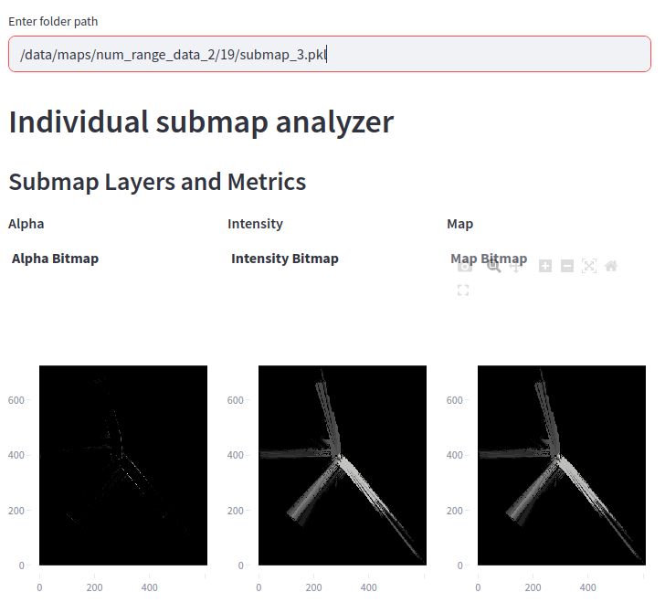

It leads to very poor map at higher `num_range_data` values

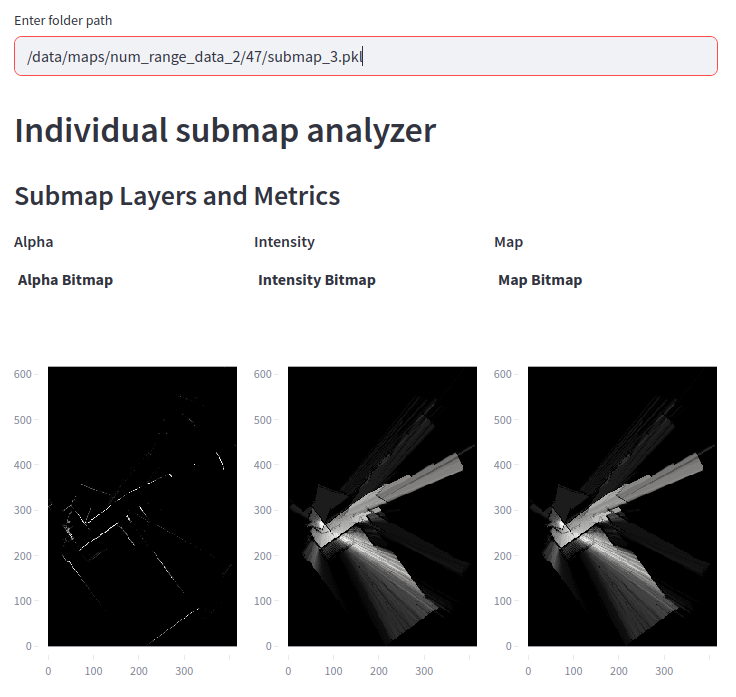

As a result, the data is very noise and not representative

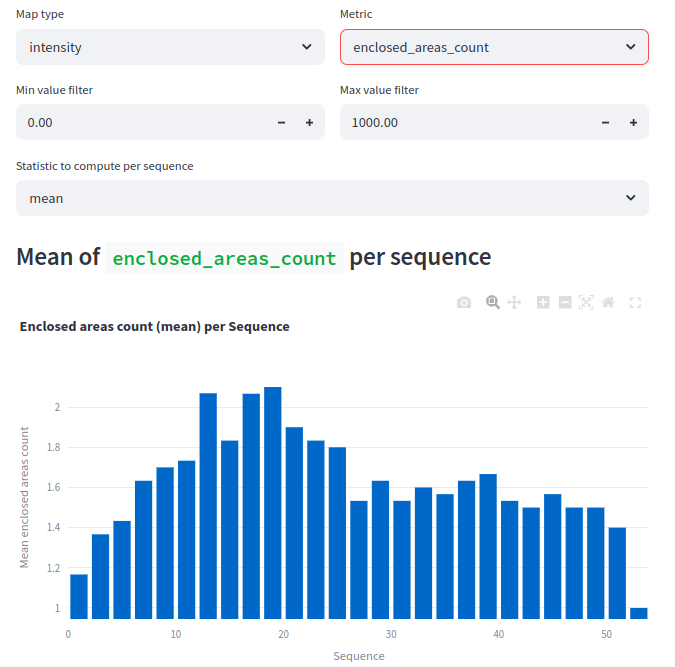
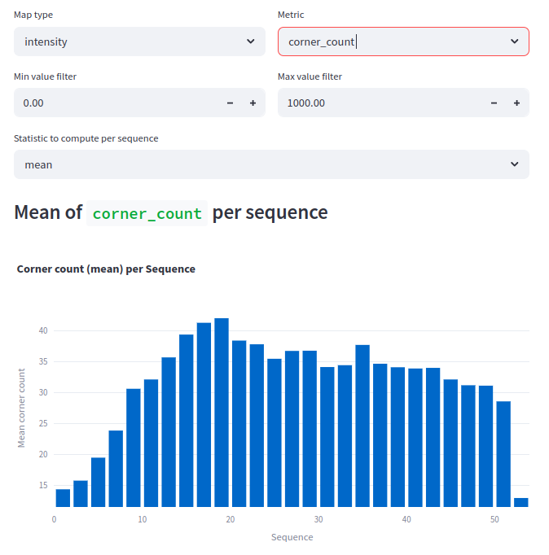

It is suggested to tune ceres parameters first.