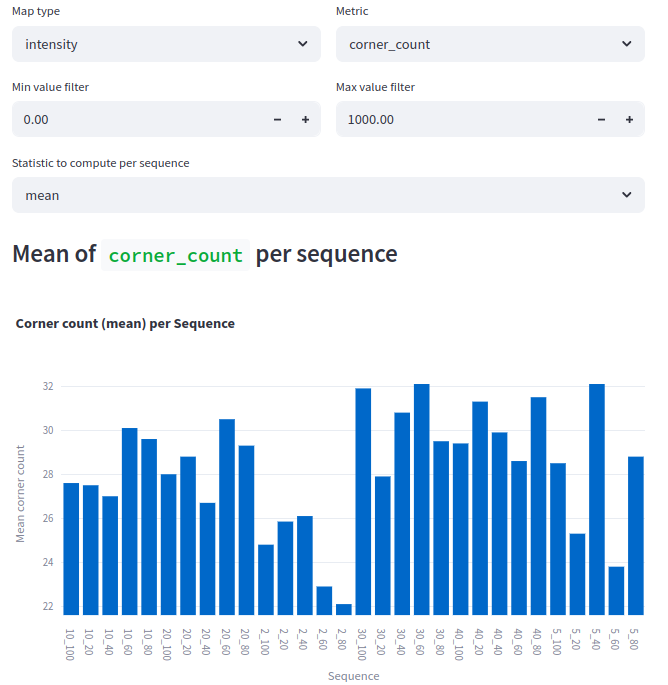
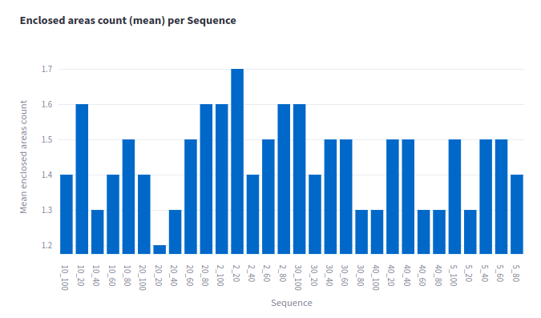

# Experiment: ceres_selection

COMMIT: 02acbc2e16973658224675758cf3be1e8af0205c

## Overview

Goal: find ceres matcher parameters to fix map drift from experiment `2025-04-20_21-35-22_num_range_data_selection_2`. 

## Results

Study of individual maps show that generally nothing changed. 

Metrics are noisy: 

at points `20_20` and `2_80` there are still drifting maps. 

Enumeration over other grid is suggested as next experiment. 

