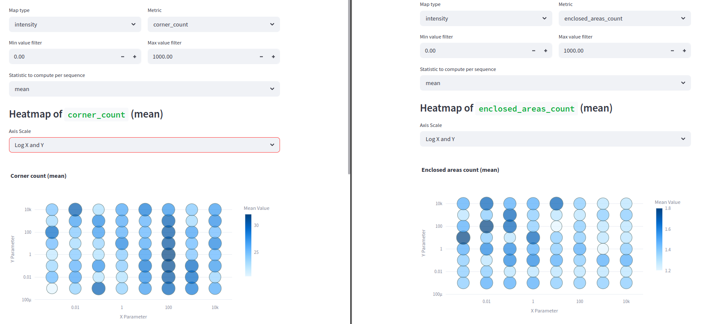

# Experiment: ceres_selection_2

COMMIT: c416d89db1d11c84975616a08407f0384d8fbb2a

## Overview

Goal: find ceres params using log scale grid

## Results
(Results are from visualization built on commit `857df4cb94627a6ce6f258bf9ce2ac041a49ab27`)

As I can see, there is no way to make simple conclusion. Probably, other optimization method (not grid search) is needed

