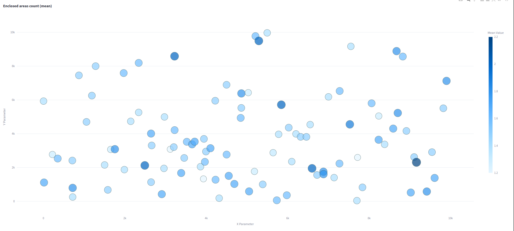
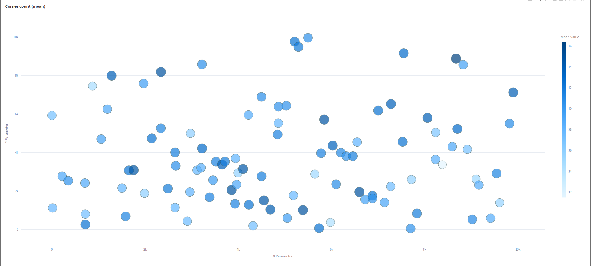

# Experiment: ceres_selection_3

COMMIT: b5158e0b37d889fbffacf5f46eeb31aae53fab98

## Overview

The goal is to check if hyperopt is working correct and if it is usable for ceres parmeters optimization

## Results

```
==> Optimization finished!
Best parameters found (according to primary loss):
{
  "trajectory_builder.trajectory_builder_2d.ceres_scan_matcher.rotation_weight": 7716.66257214677,
  "trajectory_builder.trajectory_builder_2d.ceres_scan_matcher.translation_weight": 2597.745199260908
}

Best trial details (Trial Index: 14):
  Primary Loss (enclosed_areas_count): 1.2000
root@71e73189a7ca:~# 
```

Seems that optimizer behaves like random search. Thus, explicit algorithm specification is needed.



Moreover, other metrics (`corner_count` for example), looks the same way randomly:

