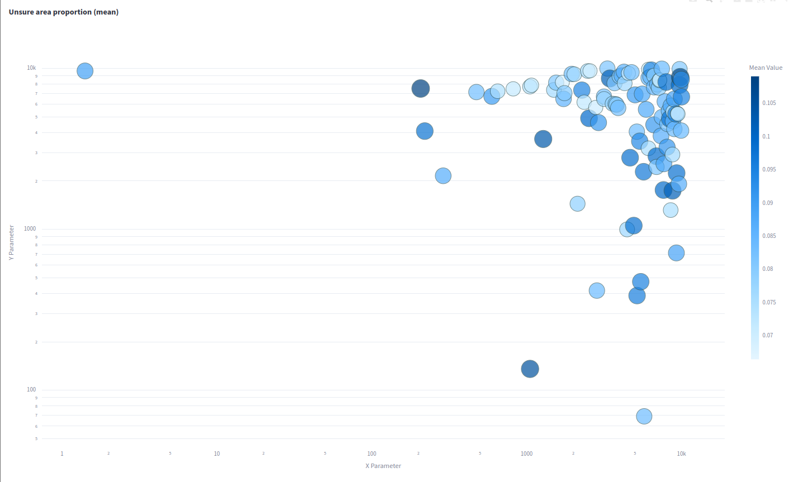
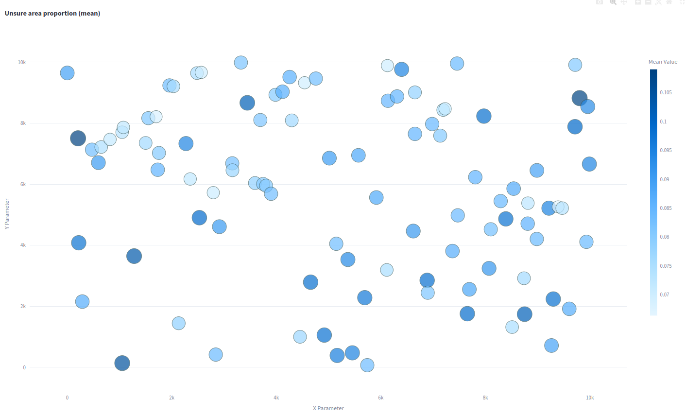

# Experiment: ceres_selection_4

COMMIT: 99ac3d9d8cc86dd1c3af236ceb97f5b25209968f

## Overview

The goal is to rerun `2025-05-01_17-54-50_ceres_selection_3` with more robust metric (`unsure_area_proportion`)

## Results

Tuning system is not working. Espesially, because it does not sample points in log scale. Probably, it is needed to tune ceres parameters in log scale. 

Even in uniform scale, results does not make much sense.

According to [documentation](https://hyperopt.github.io/hyperopt/getting-started/search_spaces/), explicit mention of distribution is indeed needed.