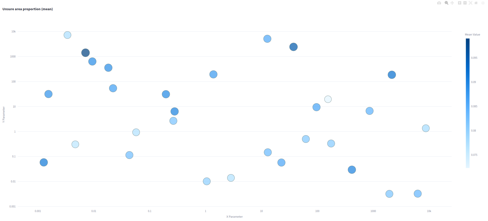

# Experiment: ceres_selection_5

COMMIT: f7066eeff479cabb808edef2106feccf7dac55e9

## Overview

Goal: rerun `2025-05-01_21-31-21_ceres_selection_4` with explicilty specified log scale of ceres parameters (with reduced number of iterations for simplicity)

## Results

It samples correctly using log space. However, it is still unclear it best point found is indeed the best, because it is not clear if the area around 

