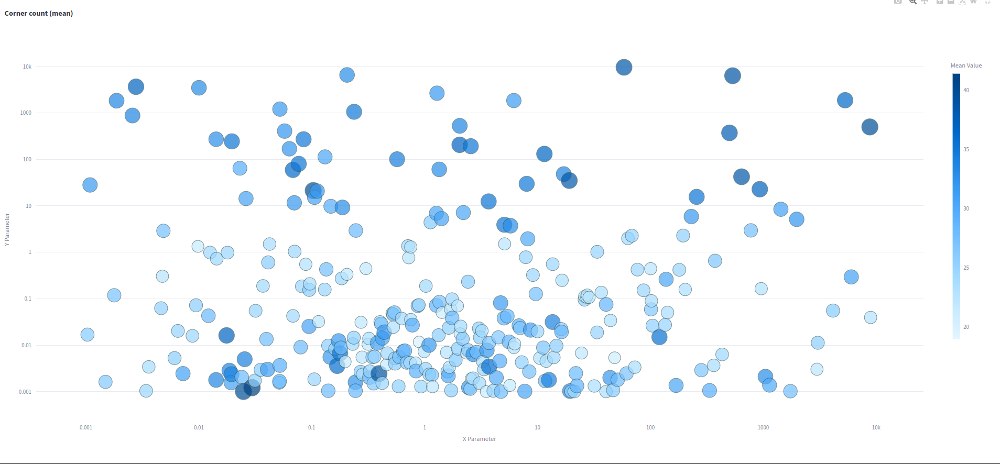
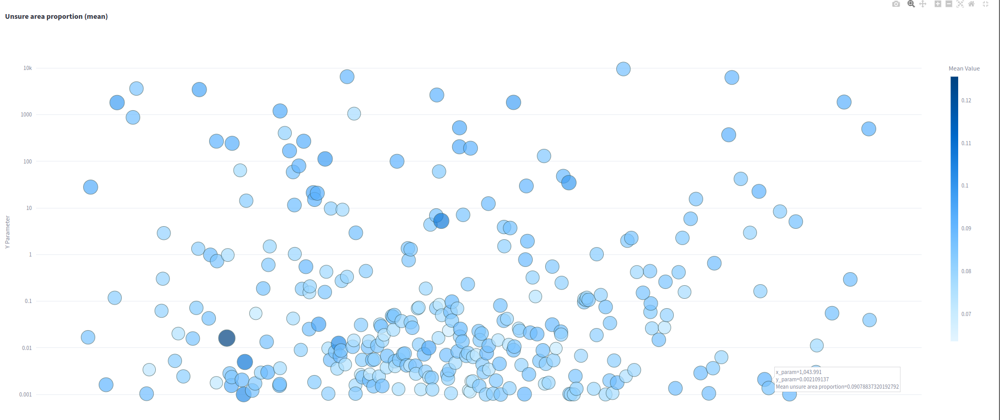

# Experiment: ceres_selection_6

COMMIT: 3b6e2fd70ae67ac6a51f22f58a638bd042009c81

## Overview

The goal is to rerun `2025-05-02_09-57-15_ceres_selection_5` with larger search parameters to get reliable quality estimation.

## Results

Seems that patterns patterns are findable and tuning works (generally)

Corner count patterns

In uncertain areas it is more difficult to catch the pattern:

Surface construction is needed to find the best parameter using 3D plit

