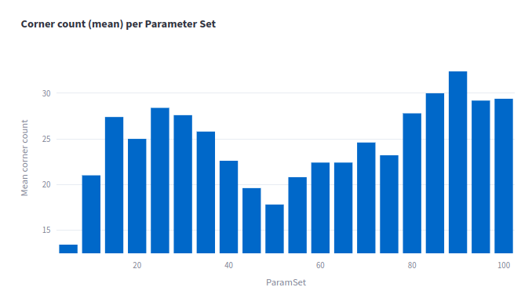
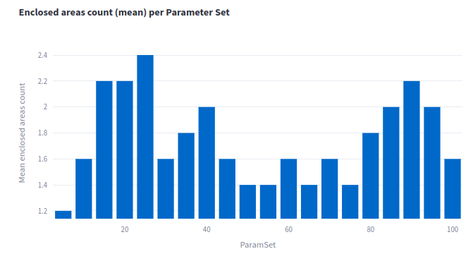
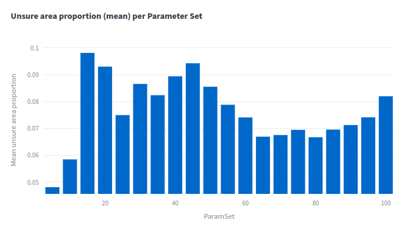
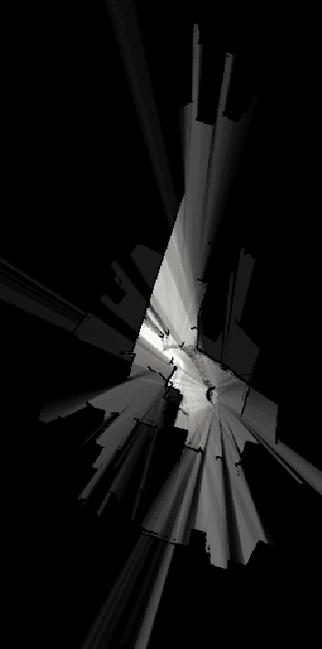
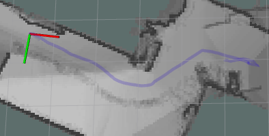

# Experiment: num_range_data_selection_3

COMMIT: 7916f9528577d6778dfa17008391cee72d9f7b50

## Overview

The goal is to select correct `num_range_data` having scans and ceres solver tuned

## Results

Plots below are for intensity channel. From metrics it is not clear which value to select.

Because of false obstacles in front of a robot, min/max ranges must be tuned according to sensor's configuration

There is a clear trace of an operator walking near robot:

