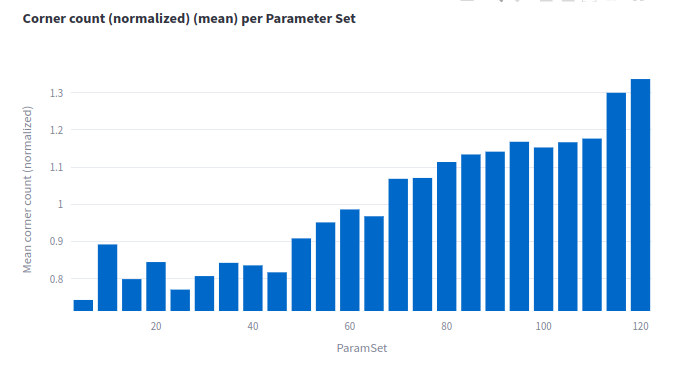
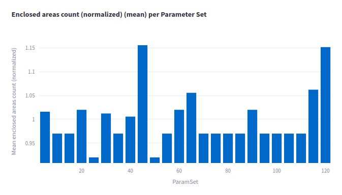
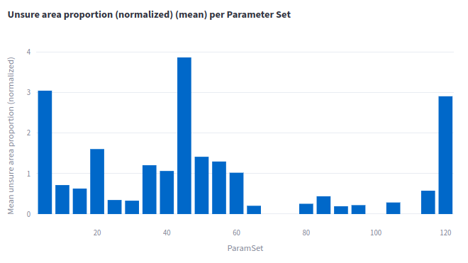

# Experiment: num_accumulated_range_data_selection_6

COMMIT: d332d917a8659ba0241d9249a67fe90a54b537e9

## Overview

Goal: select `num_accumulated_range_data` with `min_range`, `max_range` configured according to Lidar's specification (in contrast to `2025-04-19_14-10-01_num_accumulated_range_data_selection_5`) 

## Results

All metrics show that 25-30 is a relatively good choice

(all images are normalized by map id, shown iver intensity channel)

==> Range 20-35 must be studied better
