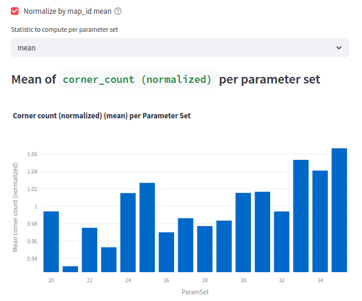
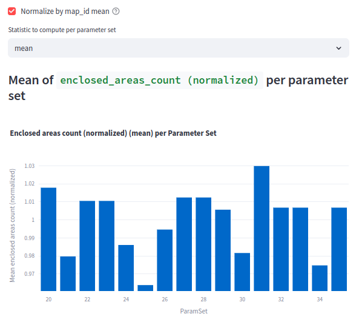
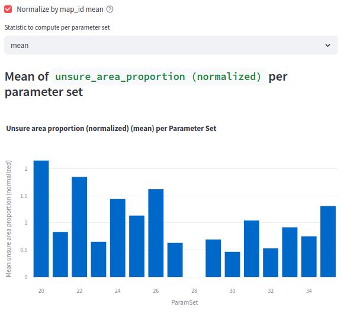

# Experiment: num_accumulated_range_data_selection_7

COMMIT: 9d185c5f2a40c3dc9f2b2f7dd332584e2835d646

## Overview

Check range 20-35. See `2025-05-12_18-02-15_num_accumulated_range_data_selection_6` for details

Note: number of samples increased to 20 to improve robustness.

## Results

Selected value 28 as it minimizes uncertainty metric and this value shows "good" results by other metrics.

