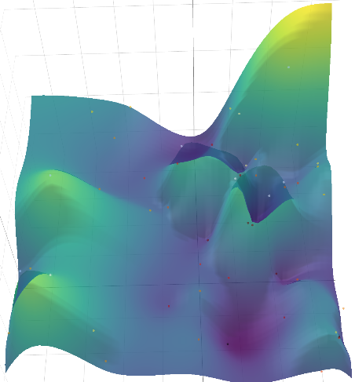

# Experiment: ceres_selection_7

COMMIT: d34c974b74354a1940050c0b20aa4ae3b9c099de

## Overview

Select ceres parameters after `2025-05-12_18-53-44_num_accumulated_range_data_selection_7`

## Results

More data tries are needed to have robust min



```
Best parameters found (according to primary loss):
{
  "trajectory_builder.trajectory_builder_2d.ceres_scan_matcher.rotation_weight": 0.020086516348328098,
  "trajectory_builder.trajectory_builder_2d.ceres_scan_matcher.translation_weight": 0.26593869858292596
}

Best trial details (Trial Index: 47):
  Primary Loss (unsure_area_proportion): 0.0784
```