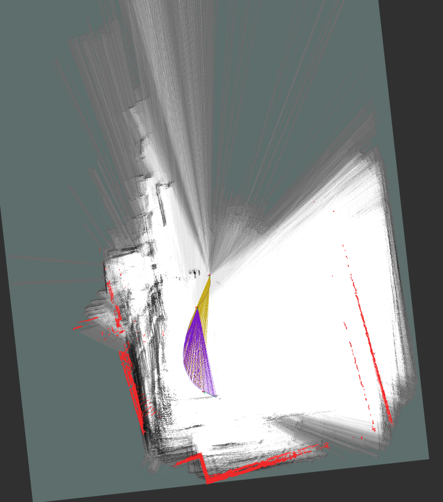
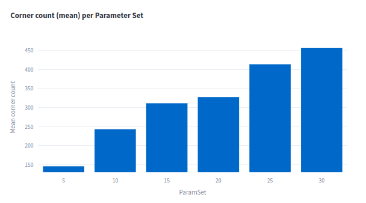
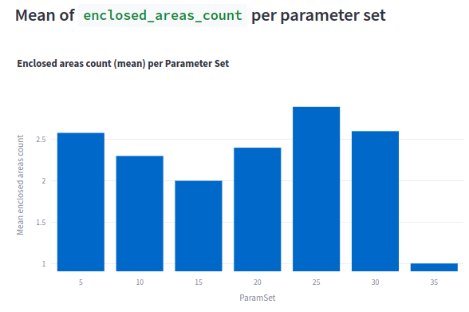

# Experiment: tune_uzh_ta_1

COMMIT: a7acd2369aa0f397281e9d6b433ff7802b2e2bab

## Overview

The goal is to check if tuning pipeline used in earlier experiments can be generalized to `uzh_tracking_area_run2` from [Hilti 2021](https://hilti-challenge.com/dataset-2021.html)

At defauls things go very wrong very quickly:

Note: config is taken from ac843d8b383495d14fba117e42d016c45f72d1c1

## Results

Experiment is interrupted as it is clear that the best answer is `<30`:

Note: at 35 the result is not final, so it is ok that the value is small