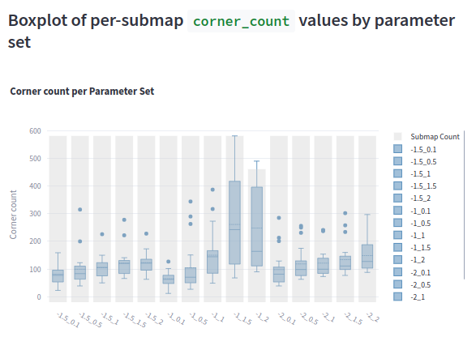
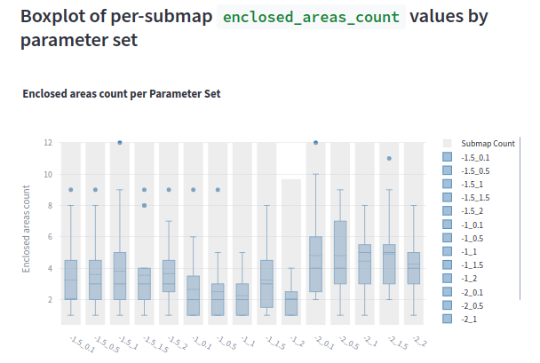
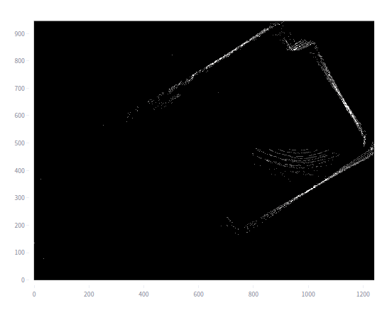
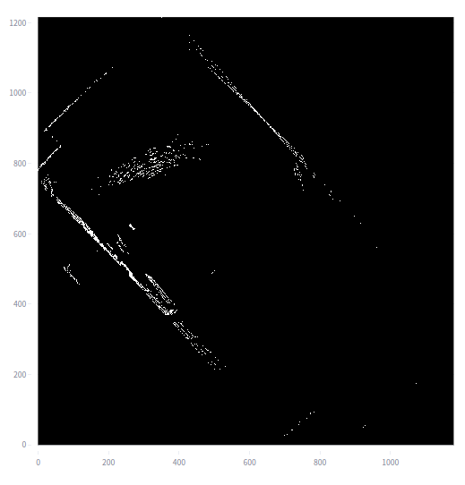

# Experiment: tune_uzh_ta_3

COMMIT: 192ceace1db52a0d9a6501de9e331843081bcd01

## Overview

Goal: select 
`TRAJECTORY_BUILDER_2D.min_z` and
`TRAJECTORY_BUILDER_2D.max_z`.

## Results

Interrupted due to error:
```
Cartographer: 2025-05-15 20:22:42.159 [RTPS_TRANSPORT_SHM Error] Failed init_port fastrtps_port7551: open_and_lock_file failed -> Function open_port_internal
BagPlay: 2025-05-15 20:22:42.185 [RTPS_TRANSPORT_SHM Error] Failed init_port fastrtps_port7551: open_and_lock_file failed -> Function open_port_internal
```

which is likely a ros bug. 

`[-1, 1]` seems to give the most rationale value.






Visual check shows that scans are not perfect but ok:






Desided to keep `[-1, 1]`