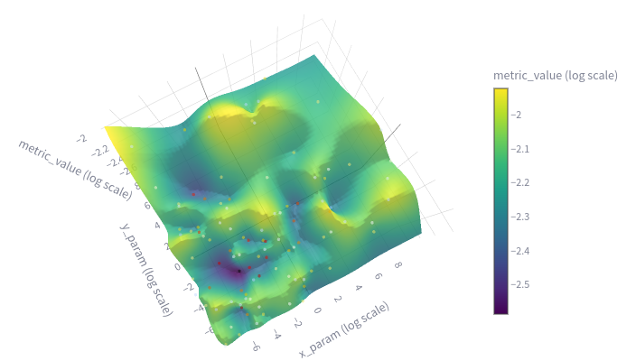

# Experiment: tune_uzh_ta_4

COMMIT: 80e3caabf21c2754dcc43aae7aac2a663a85550a

## Overview

Find ceres params

## Results



```
Best parameters found (according to primary loss):
{
  "trajectory_builder.trajectory_builder_2d.ceres_scan_matcher.rotation_weight": 0.013403649006343462,
  "trajectory_builder.trajectory_builder_2d.ceres_scan_matcher.translation_weight": 0.05872534702657144
}

Best trial details (Trial Index: 65):
  Primary Loss (unsure_area_proportion): 0.0724
```

Value seems correct as there are small values around minumum point: 

