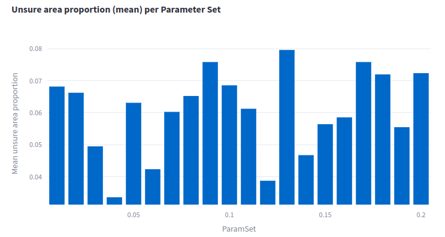
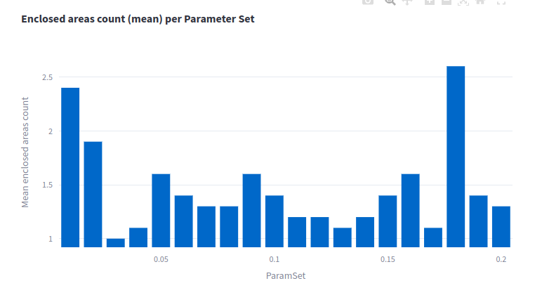
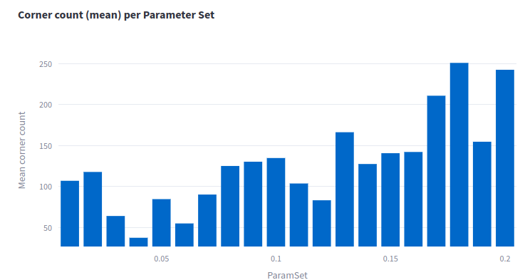

# Experiment: tune_uzh_ta_5

COMMIT: 407b7624881911c852d0cf051988a8813e6b9280

## Overview

More tuning on individual scans is needed. As ceres optimization in previous experiment did not lead to improvements. 

The goal is to fund voxel filter size. reliable scans are needed! to detect wall properly.

## Results

According to all 3 metrics, `0.04` is good enough solution.

