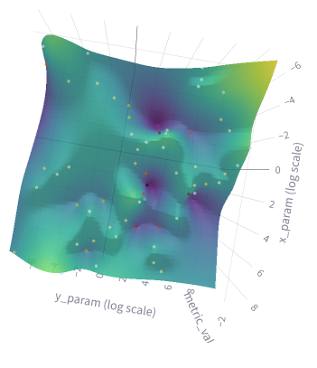

# Experiment: tune_uzh_ta_6

COMMIT: f58c0efef387a2629ad86964f80a35216344c0d6

## Overview

Goal: try to tune ceres again, after local scans has improved.

## Results

```
==> Optimization finished!
Best parameters found (according to primary loss):
{
  "trajectory_builder.trajectory_builder_2d.ceres_scan_matcher.rotation_weight": 12.579273353369318,
  "trajectory_builder.trajectory_builder_2d.ceres_scan_matcher.translation_weight": 15.089019440026632
}

Best trial details (Trial Index: 58):
  Primary Loss (unsure_area_proportion): 0.0864
```

Despite some good point is found, it is not clear from surface if it is inedeed best point


