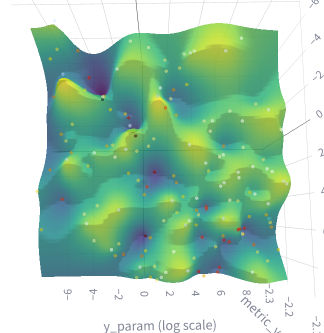
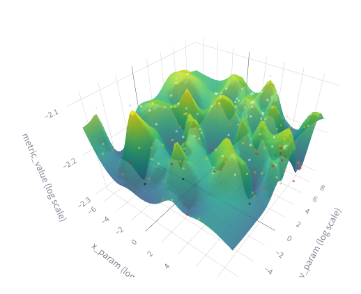

# Experiment: tune_uzh_ta_7

COMMIT: 69e5911a7b3e1887d82abe2000d6ff809b0bd406

## Overview

Goal: find ceres parameters having decreased map resolution.

## Results

Data is too noisy to make any conclusions. 

There is several approximately minimums:

Decided to rerun experiment with larger submaps to get more robust results. 