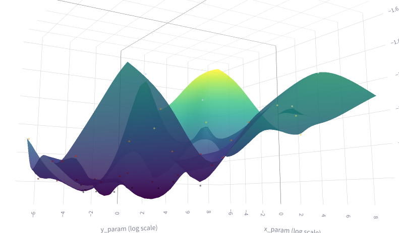
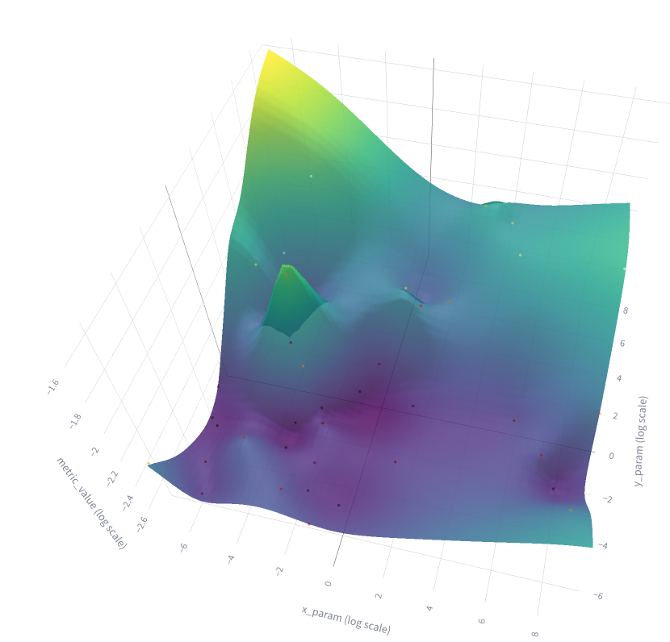

# Experiment: tune_uzh_ta_8

COMMIT: 4cda7fe99562dd8a281e55134d2169b4edead853

## Overview

Try to overtune one but large submap. Can we use many iterations then?

## Results

```
    Mean metrics calculated successfully: {"unsure_area_proportion": "0.0678", "occupied_proportion": "0.2719", "corner_count": "30.0000", "enclosed_areas_count": "1.0000"}
                                                                                  
==> Starting Trial 2.3953293993523546_38.44696367001127 with params: {"trajectory_builder.trajectory_builder_2d.ceres_scan_matcher.rotation_weight": 2.3953293993523546, "trajectory_builder.trajectory_builder_2d.ceres_scan_matcher.translation_weight": 38.44696367001127}
```

From the plot it is clear that small values should be taken:



Because there is clear min:



Selected 0.04 for both params.